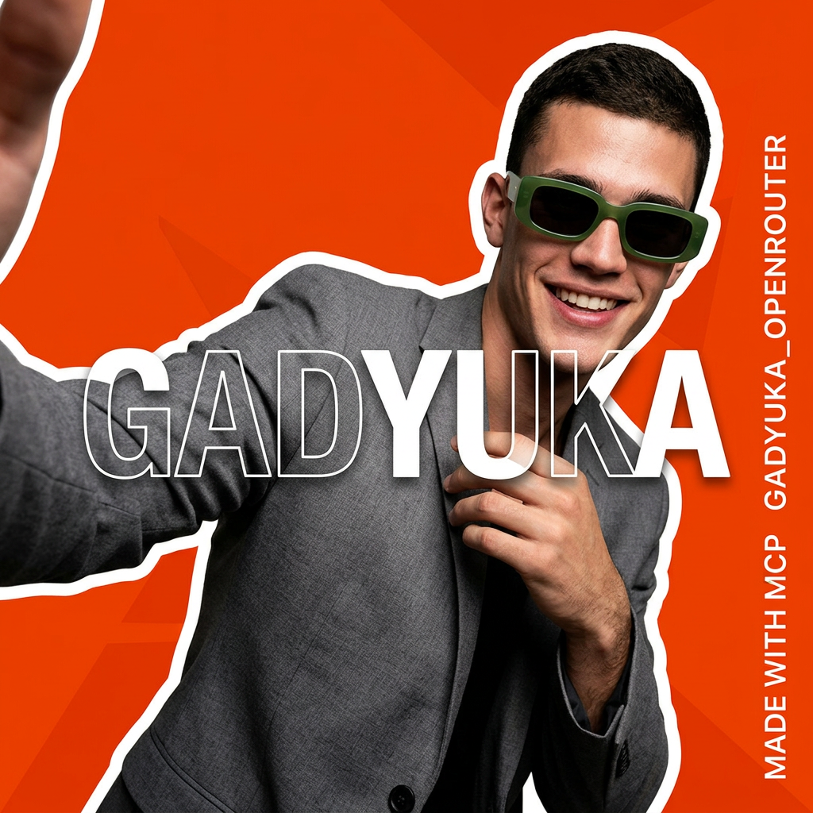
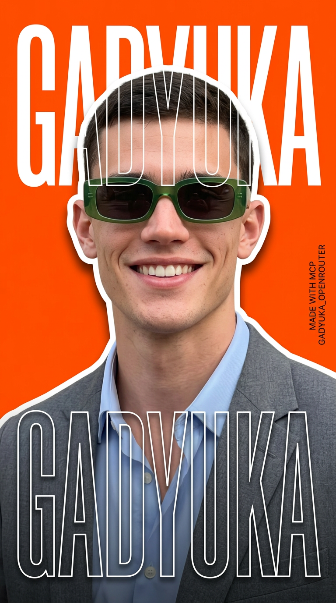
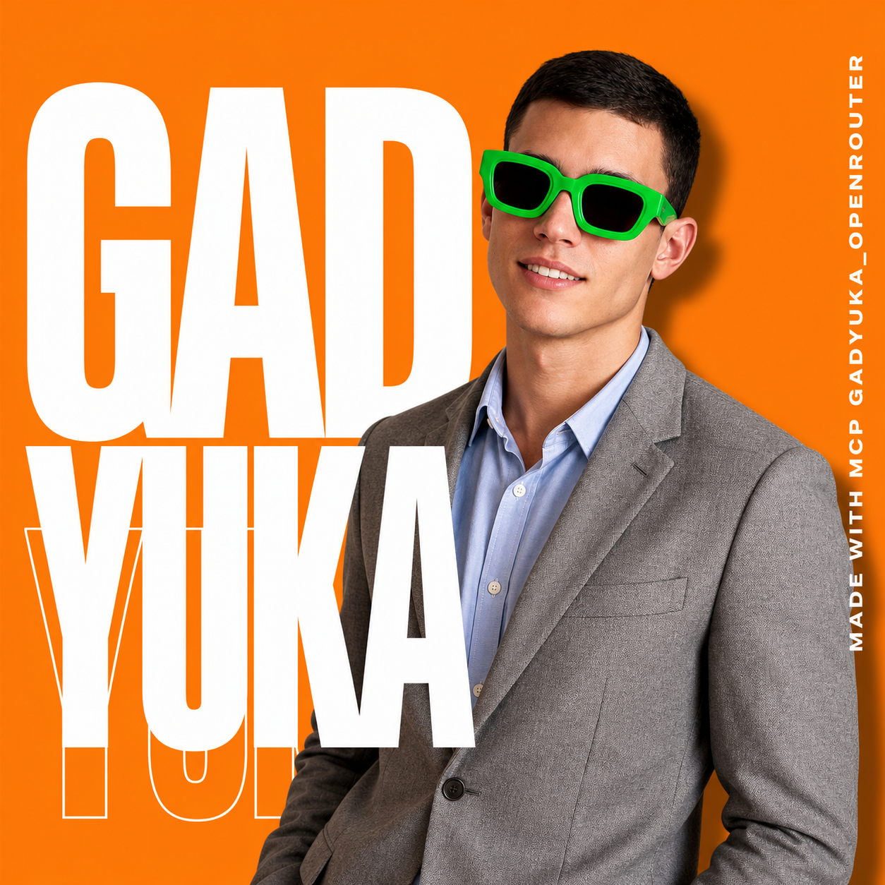

# Demo — real images made through `gadyuka_openrouter`

Every image below was generated **through the gadyuka_openrouter MCP server** in a single local
run, driving the `generate_image` tool over stdio. Each one is a branded poster that takes the
**look of a layout reference** and the **identity of a character photo**, and renders the English
caption **“MADE WITH MCP GADYUKA_OPENROUTER”** on the image.

**Total real spend for this whole demo: `$0.77`** (10 images across 4 models), tracked automatically
by the server's cost ledger — see the breakdown below.

## Inputs

| Layout / style reference | Character reference |
|---|---|
|  |  |
| Bold orange poster, big typography, cut-out subject | The person whose identity is carried into the posters |

> Note: the style reference contains its own text (a headline + phone number). Image models tend to
> copy that text, so the cleanly-branded variants below describe the style in words and use **only the
> character photo** as a reference. See the skill's `prompt-engineering.md` for the why.

## Three formats (one cheap model: `google/gemini-3.1-flash-image-preview`)

Same brief, three social/web formats — the "create N variations in different formats" use case.

| 1:1 — feed post | 16:9 — website / banner |
|---|---|
|  |  |

**9:16 — story / reel**

## Across models (premium single shots, 1 reference each)

| `openai/gpt-image-2` | `openai/gpt-5.4-image-2` | `google/gemini-3-pro-image-preview` |
|---|---|---|
|  |  |  |
| 1:1, great text | 1:1, great text | 9:16, sharpest typography |

## Cost breakdown (recorded by `get_usage`)

| Model | Images | Spend |
|---|---|---|
| `google/gemini-3.1-flash-image-preview` | 6 | $0.41 |
| `openai/gpt-image-2` | 2 | $0.16 |
| `google/gemini-3-pro-image-preview` | 1 | $0.14 |
| `openai/gpt-5.4-image-2` | 1 | $0.07 |
| **Total** | **10** | **$0.77** |

Re-running any identical request returns the saved file **for free** (cache hit, `$0.00`).

## How it was made

1. The server was started locally over stdio with `OPENROUTER_API_KEY` in its env.
2. A budget cap was set (`set_budget` → `$1.90`, block) as a safety net.
3. For each variant, `generate_image` was called with the prompt, the reference image(s),
   `aspect_ratio`/`quality`, and `output_dir` → this folder.
4. Spend was checked with `get_usage` between calls to stay well under budget.

Notes on text fidelity: GPT Image 2, GPT-5.x Image and Gemini 3 Pro Image render the brand caption
cleanly; the cheaper flash model occasionally splits/misspells the long `GADYUKA_OPENROUTER` string —
expected for fast models, regenerate or use a stronger model for hero shots.
